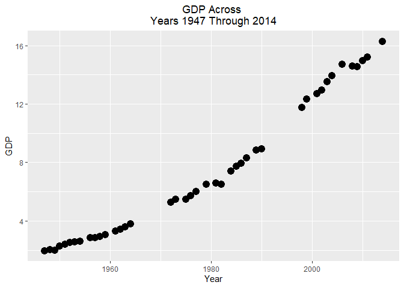
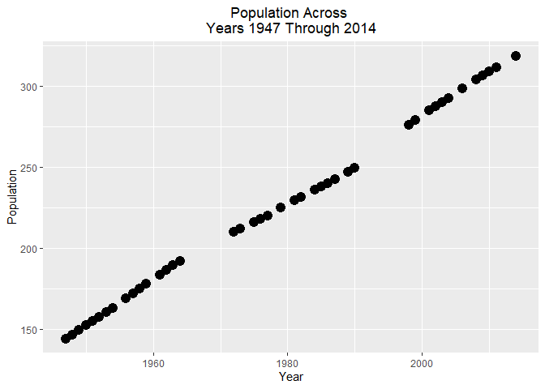
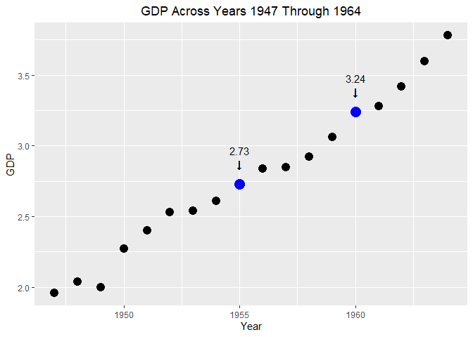
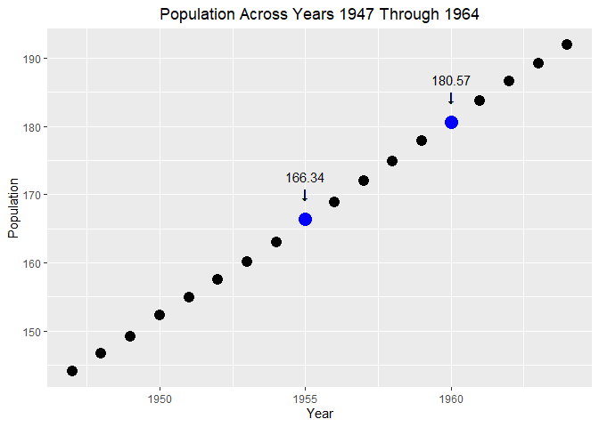

Sample Regression
================

This dataset includes GDP in Trillions of US$ and Population in
Millions.

    ##    Year Population   GDP
    ## 1  2014     318.86 16.29
    ## 2  2011     311.72 15.19
    ## 3  2010     309.35 14.94
    ## 4  2009     306.77 14.54
    ## 5  2008     304.09 14.58
    ## 6  2006     298.38 14.72
    ## 7  2004     292.81 13.95
    ## 8  2003     290.11 13.53
    ## 9  2002     287.63 12.96
    ## 10 2001     284.97 12.71
    ## 12 1999     279.04 12.32
    ## 13 1998     275.85 11.77
    ## 14 1990     249.62  8.91
    ## 15 1989     246.82  8.85
    ## 16 1987     242.29  8.29
    ## 17 1986     240.13  7.94
    ## 18 1985     237.92  7.71
    ## 19 1984     235.82  7.40
    ## 20 1982     231.66  6.49
    ## 21 1981     229.47  6.59
    ## 23 1979     225.06  6.50
    ## 24 1977     220.24  6.02
    ## 25 1976     218.04  5.73
    ## 26 1975     215.97  5.49
    ## 27 1973     211.91  5.46
    ## 28 1972     209.90  5.25
    ## 29 1964     191.89  3.78
    ## 30 1963     189.24  3.60
    ## 31 1962     186.54  3.42
    ## 32 1961     183.69  3.28
    ## 33 1959     177.83  3.06
    ## 34 1958     174.88  2.92
    ## 35 1957     171.98  2.85
    ## 36 1956     168.90  2.84
    ## 37 1954     163.03  2.61
    ## 38 1953     160.18  2.54
    ## 39 1952     157.55  2.53
    ## 40 1951     154.88  2.40
    ## 41 1950     152.27  2.27
    ## 42 1949     149.19  2.00
    ## 43 1948     146.63  2.04
    ## 44 1947     144.13  1.96

Create scatterplots of GDP vs. Year and Population vs. Year. Observe
that there are 3 distinct linear regions in the data, 1947-1964,
1972-1990 and 1998-2014. Isolate the distinct regions into their own
data frames, R1, R2 and R3.

``` r
qplot(Year, GDP, data=popgdp)+geom_point(size=4) + ggtitle("GDP Across 
Years 1947 Through 2014")+theme(plot.title = element_text(hjust = 0.5))
```

<!-- -->

``` r
qplot(Year, Population, data=popgdp)+geom_point(size=4) + ggtitle("Population Across 
Years 1947 Through 2014")+theme(plot.title = element_text(hjust = 0.5))
```

<!-- -->

``` r
R1<-popgdp %>% filter(Year %in% c(1947:1964)) %>% arrange(Year)
R2<-popgdp %>% filter(Year %in% c(1972:1990)) %>% arrange(Year)
R3<-popgdp %>% filter(Year %in% c(1998:2014)) %>% arrange(Year)
```

There are two missing years in R1. (1955, 1960 found manually) Here we
create a linear regression model to estimate the Pop and GDP for each of
the missing years. Will use univariate regression with corresponding
variables.

    ## [1] 1955 1960

Enhance R1 to include the newly found data for the missing years.

``` r
attach(R1)
model_GDP_Year <- lm(GDP ~ Year)
model_GDP_Year
```

    ## 
    ## Call:
    ## lm(formula = GDP ~ Year)
    ## 
    ## Coefficients:
    ## (Intercept)         Year  
    ##    -194.732        0.101

``` r
model_Pop_Year <- lm(Population ~ Year)
model_Pop_Year
```

    ## 
    ## Call:
    ## lm(formula = Population ~ Year)
    ## 
    ## Coefficients:
    ## (Intercept)         Year  
    ##   -5398.729        2.847

``` r
predict(model_GDP_Year, data.frame(Year=1955))
```

    ##        1 
    ## 2.730999

``` r
predict(model_GDP_Year, data.frame(Year=1960))
```

    ##        1 
    ## 3.236021

``` r
predict(model_Pop_Year, data.frame(Year=1955))
```

    ##       1 
    ## 166.339

``` r
predict(model_Pop_Year, data.frame(Year=1960))
```

    ##        1 
    ## 180.5719

``` r
EnhancedR1 <- R1 %>% add_row(Year = 1955, Population = 166.34, GDP = 2.73) %>% add_row(Year = 1960, Population = 180.57, GDP = 3.24) %>% arrange(Year)
EnhancedR1
```

    ##    Year Population  GDP
    ## 1  1947     144.13 1.96
    ## 2  1948     146.63 2.04
    ## 3  1949     149.19 2.00
    ## 4  1950     152.27 2.27
    ## 5  1951     154.88 2.40
    ## 6  1952     157.55 2.53
    ## 7  1953     160.18 2.54
    ## 8  1954     163.03 2.61
    ## 9  1955     166.34 2.73
    ## 10 1956     168.90 2.84
    ## 11 1957     171.98 2.85
    ## 12 1958     174.88 2.92
    ## 13 1959     177.83 3.06
    ## 14 1960     180.57 3.24
    ## 15 1961     183.69 3.28
    ## 16 1962     186.54 3.42
    ## 17 1963     189.24 3.60
    ## 18 1964     191.89 3.78

Below are scatterplots (Year vs. Population) and (Year vs. GDP) of the
enhanced frame R1 (this includes the values missing from the original
data frame R1). The interpolated points are clearly marked.

``` r
p <- qplot(Year, GDP, data=EnhancedR1)+geom_point(size=4) + geom_point(size=5, data = subset(EnhancedR1, Year == 1955 | Year == 1960), color = "blue") 
p2<-p + geom_text(x=1955, y= 2.73,label=sprintf('\u2193'), hjust=0.5, vjust=-2)+annotate("text",x=1955, y= 2.73,label="2.73",  vjust= -3.5)
gdpPlot <- p2 + geom_text(x=1960, y= 3.24,label=sprintf('\u2193'), hjust=0.5, vjust=-2)+annotate("text",x=1960, y= 3.24,label="3.24",  vjust= -3.5)
gdpPlot + ggtitle("GDP Across Years 1947 Through 1964")+theme(plot.title = element_text(hjust = 0.5))
```

<!-- -->

``` r
# Year vs. Population
p3 <- qplot(Year, Population, data=EnhancedR1)+geom_point(size=4) + geom_point(size=5, data = subset(EnhancedR1, Year == 1955 | Year == 1960), color = "blue")
p4 <- p3 + geom_text(x=1955, y= 166.34,label=sprintf('\u2193'), hjust=0.5, vjust=-2)+annotate("text",x=1955, y= 166.34,label="166.34",  vjust= -3.5)
popPlot <- p4 + geom_text(x=1960, y= 180.57,label=sprintf('\u2193'), hjust=0.5, vjust=-2)+annotate("text",x=1960, y= 180.57,label="180.57",  vjust= -3.5)
popPlot + ggtitle("Population Across Years 1947 Through 1964")+theme(plot.title = element_text(hjust = 0.5))
```

<!-- -->
